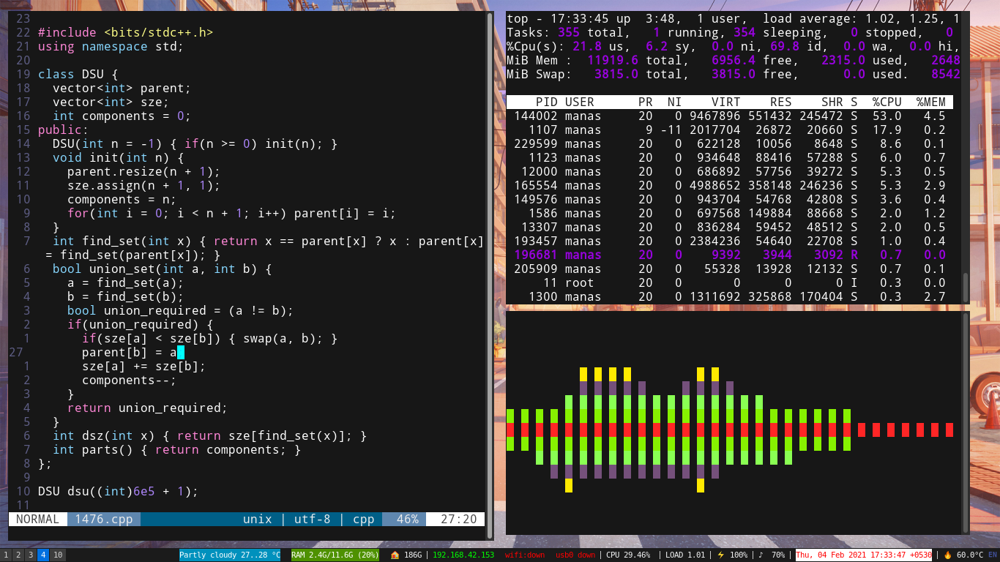
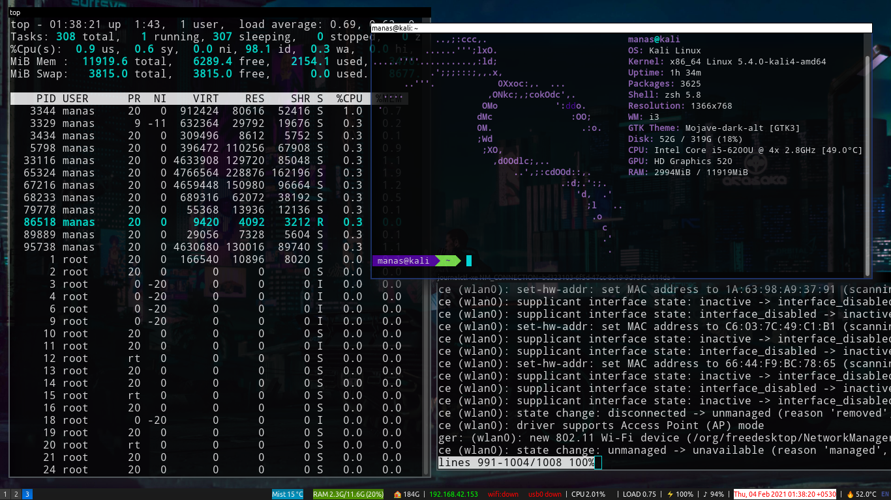

Rice your linux distro to match with mine, as shown in the screenshots below

Operating System: [Kali Linux](https://www.kali.org/)  
Window Manager  : [i3wm](https://i3wm.org/)  
Notifications   : [dunst](https://github.com/dunst-project/dunst)  
Compositor      : [compton](https://github.com/chjj/compton)  
Launcher        : [dmenu](https://tools.suckless.org/dmenu/)  
Shell           : [zsh](https://www.zsh.org/)  

I use UltiSnips to add custom code-snippets. For autocompletion, I use YouCompleteMe.

Compton off, and [cli-visualizer](https://github.com/dpayne/cli-visualizer)  

Compton running and 720p resolution:  
  

Special thanks to [Jonas Devlieghere](https://github.com/JDevlieghere) whose YCM config I copied as-it-is from [here](https://jonasdevlieghere.com/a-better-youcompleteme-config/). His flags were just perfect except I added a few -Wnoerrors because the compiler was giving tonne of squiggles for the wrong programming practices I overlook all the time.
